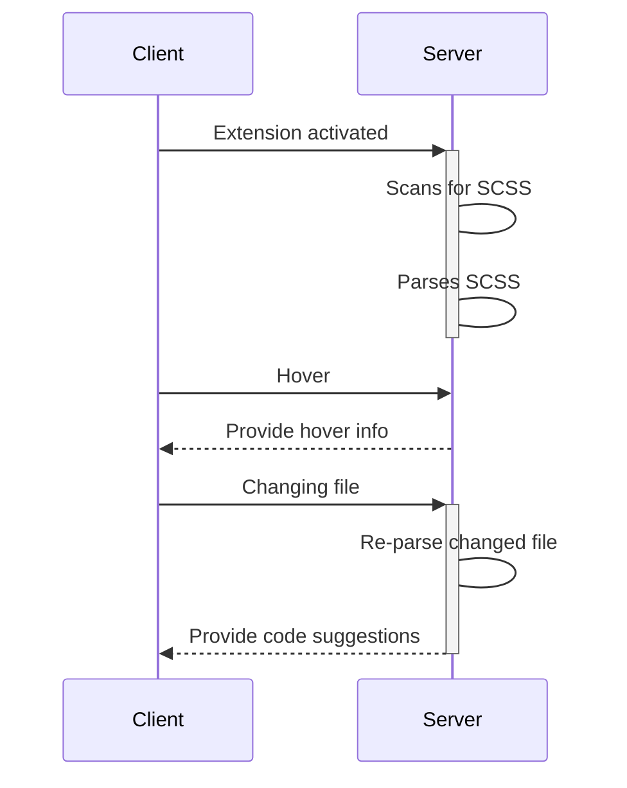
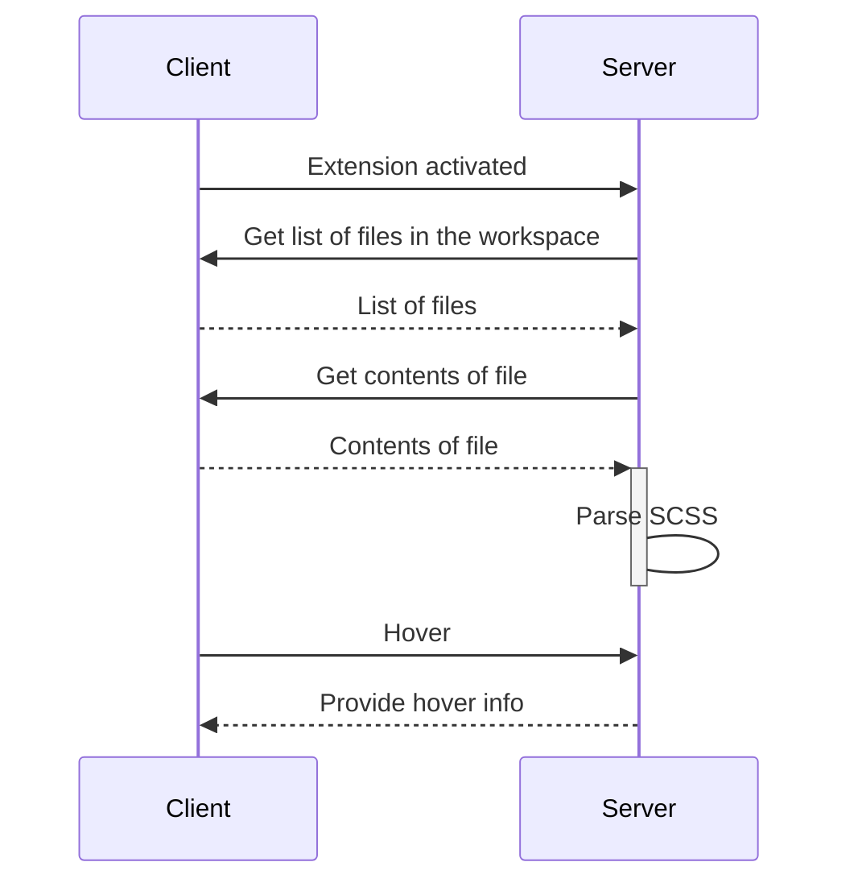

# Contributing

Thank you for showing an interest in contributing, be it to the language server or to the VS Code extension 🌟

Before you start, please make a [new Issue](https://github.com/wkillerud/some-sass/issues/new/choose). I don't always make new issues for all the things I work on. By making a new Issue we can avoid duplicating our efforts.

## Development environment

You need these things installed:

- Node.js LTS
- For the VS Code extension, but recommended either way:
  - Visual Studio Code stable
  - The extension _TypeScript + Webpack Problem Matchers_ (`amodio.tsl-problem-matcher`)

```
# install dependencies
npm install
# confirm existing tests are running
npm test
```

For the documentation you need [mdbook](https://rust-lang.github.io/mdBook/guide/installation.html). If you're on macOS and use [Homebrew](https://brew.sh) you can `brew install mdbook`.

### If using VS Code

Go to the _Run and Debug_ pane in VS Code and run _Launch extension_. Rebuild the project and restart the debugging session to see changes take effect.

If you get a warning, ensure you have the _TypeScript + Webpack Problem Matchers_ (`amodio.tsl-problem-matcher`) extension installed and active.

## Architecture

This extension consists of a [client for VS Code](https://github.com/wkillerud/some-sass/blob/main/vscode-extension) and a [language server](https://github.com/wkillerud/some-sass/blob/main/packages/language-server). The client starts the server on activation.

The server then:

1. [scans the workspace](https://github.com/wkillerud/some-sass/blob/main/packages/language-server/src/scanner.ts)
2. [parses](https://github.com/wkillerud/some-sass/blob/main/packages/language-server/src/parser/parser.ts) SCSS code
3. puts the parsed documents in a [in-memory context](https://github.com/wkillerud/some-sass/blob/main/packages/language-server/src/context-provider.ts)

The client requests information from the server when needed, and notifies the server when a file changes.

See [packages/langauge-server/src/server.ts](https://github.com/wkillerud/some-sass/blob/main/packages/langauge-server/src/server.ts) for the event listeners on the server side, and the [features folder in the server](https://github.com/wkillerud/some-sass/tree/main/packages/language-server/src/features) for code supporting the different features.



### Browser version

This extension also works with VS Code in the browser. It works more or less the same as the regular Node version, except it doesn't have direct access to the file system.

To work around this, [the server](https://github.com/wkillerud/some-sass/blob/main/packages/language-server/src/file-system-provider.ts) makes requests to [the client](https://github.com/wkillerud/some-sass/blob/main/vscode-extension/src/client.ts), which then uses the [FileSystem API](https://code.visualstudio.com/api/references/vscode-api#FileSystem) to work with files and directories, before sending the result back to the server.



## Manual testing

To test your changes in VS Code:

- Go to the Run and Debug section
- Run the `Launch extension` configuration

A new window should open with the title `[Extension Development Host]`. In this window you can open whatever project you want to use for testing. If you don't have one you can open the folder `vscode-extension/test/fixtures/` in this repository.

Every time you make a change you need to restart `Launch extension`.

Test your changes and see if they work.

### Test the browser version

This extension also works in the browser. Run `npm run start:web` to open VS Code in a browser and test your changes.

Docs: [Test your web extension](https://code.visualstudio.com/api/extension-guides/web-extensions#test-your-web-extension)

## Debugging

### Debugging the Node (or regular) version

You can set breakpoints to inspect what happens in your code. At time of writing you must set these breakpoints in the _compiled output_ in `vscode-extension/dist/node-server.js`.

Open `vscode-extension/dist/node-server.js`, search for a function name close to where you want to debug, and place breakpoints where you would like. Then:

- Go to the Run and Debug pane in VS Code.
- Select `Launch extension` and start debugging.

You should see the code pause on your breakpoint. If not, try to place breakpoints elsewhere. Something unexpected may stop you from reaching your code.

### Debugging the browser version

You have two options when to debug the browser version:

1. Run in VS Code:

   - Go to the Run and Debug section
   - Run the _Launch Web Extension in VS Code_ configuration
   - Open `vscode-extension/dist/browser-server.js`, search for a function name close to where you want to debug, and place breakpoints where you would like.

2. Run in Chromium:
   - In a terminal, run `npm run start:web`
   - Open the Chromium developer tools and set breakpoints in the Sources pane.

### Debugging unit tests

Tests compile to `packages/language-server/out/test/`. If you want to debug using a unit test, you have to set breakpoints on the compiled output.

Find your test, or the code you want to debug in the `packages/language-server/out/` folder, and set breakpoints.

The extension Mocha Test Explorer (`hbenl.vscode-mocha-test-adapter`) is useful to launch individual tests in debug mode. Install the extension, open your unit test, and press the Debug button that should appear over your test.

### Debugging integration tests

Integration tests run in the Extension Development Host, and are more realistic than unit tests. However, sometimes they can be tricky to write. You can debug the tests themselves.

This method of debugging is **not recommended** if you want to debug the functionality itself. Instead, debug using the Client + Server configuration explained above, and perform the test manually.

If you want to debug the integration tests there are a few things to keep in mind, since tests run in this way use your main stable install of VS Code (not Insiders, like from the terminal):

- You will need to install Vetur (`octref.vetur`), Astro (`astro-build.astro-vscode`) and Svelte for VS Code (`svelte.svelte-vscode`).
- You **must** use default settings for Some Sass. Tip: use the included Workspace Settings.
- To compile changes in test code, run `npm run compile` in the `e2e` directory.

You set breakpoints in the compiled output. Integration tests compile to `vscode-extension/out/suite/`. Breakpoints can _only be set in test code_, meaning any code in the `e2e/out/` folder.

Breakpoints set, go to the _Run and Debug_ pane in VS Code and run the Integration Tests configuration.

### Debugging integration tests for the browser version

Like [debugging integration tests](#debugging-integration-tests), do this when you want to debug the tests themselves rather than functionality. The web integration tests compile to in `web/src/suite/`.

Set breakpoints in the compiled output (`web/dist/suite/index.js`).

At time of writing you may have to set the breakpoints after the debugger has attached. I've had the best success rate clicking repeatedly to set the breakpoint.

## Documentation

There's a documentation website in [`docs/`](./docs).

To preview the documentation on your machine you need [mdbook](https://rust-lang.github.io/mdBook/guide/installation.html). If you're on macOS and use [Homebrew](https://brew.sh) you can `brew install mdbook`.

```sh
cd docs
mdbook serve --open
```

To learn how to work with an mdbook, head over to [the mdbook user guide](https://rust-lang.github.io/mdBook/guide/creating.html).

## Conventional commits

This repository uses [conventional commits and `semantic-release`](https://github.com/semantic-release/semantic-release#how-does-it-work) to automatically publish changes merged to `main`.

Two assets are published:

- The language server is published to npm
- The VS Code extension is published to Visual Studio Marketplace and Open VSX

Keep both in mind when deciding whether a change is a patch, minor or major release.

| Commit message                                                                                                                            | Release type                                                                                                                                                         |
| ----------------------------------------------------------------------------------------------------------------------------------------- | -------------------------------------------------------------------------------------------------------------------------------------------------------------------- |
| `docs: added a guide for configuring sublime text`                                                                                        | Patch. Bugfix release, updates for runtime dependencies.                                                                                                             |
| `fix: update css-languageservice`                                                                                                         | Patch. Bugfix release, updates for runtime dependencies.                                                                                                             |
| `feat: add support for show keyword in forward`                                                                                           | Minor. New feature release.                                                                                                                                          |
| `refactor: remove reduntant options for latest language version`<br><br>`BREAKING CHANGE: The scanImportedFiles option has been removed.` | Major. Breaking release, like removing an option or changing `engines` version. <br /> (Note that the `BREAKING CHANGE: ` token must be in the footer of the commit) |
