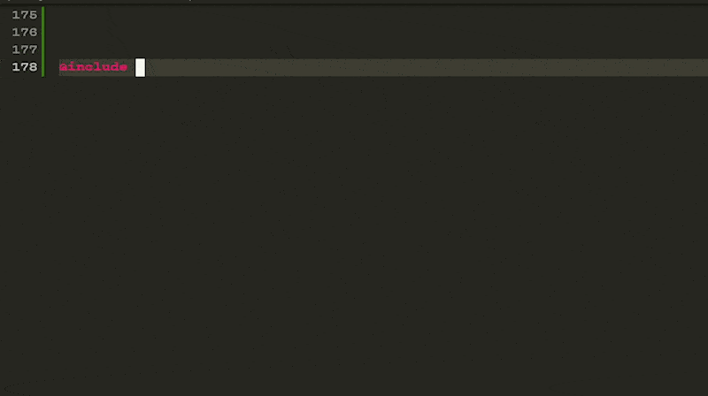
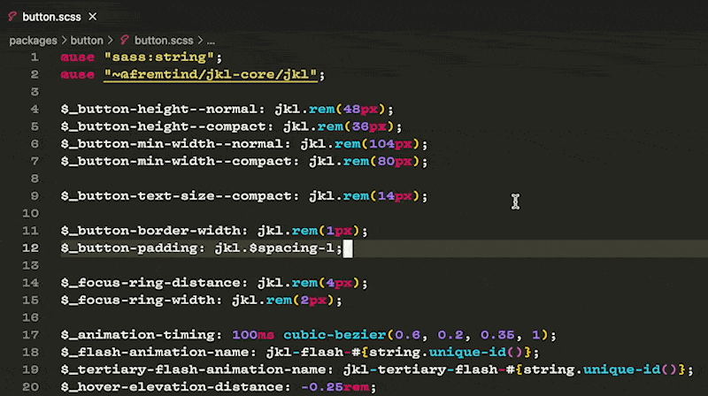

# Some Sass for Visual Studio Code

Some Sass provides code suggestions, documentation and code navigation for SCSS.

- Full support for `@use` and `@forward`, including aliases, prefixes and hiding.
- Rich documentation through [SassDoc](http://sassdoc.com).

Supports standalone SCSS, as well as style blocks inside Vue and Svelte components.

Based on SCSS Intellisense by [Denis Malinochkin and contributors](https://github.com/mrmlnc/vscode-scss). Uses the built-in VS Code language server for SCSS.

## Setup

Search for Some Sass (`SomewhatStationery.some-sass`) from the extension installer within VS Code or install from [the Marketplace](https://marketplace.visualstudio.com/items?itemName=SomewhatStationery.some-sass).

If you have SCSS IntelliSense (`mrmlnc.vscode-scss`) installed you should disable or uninstall it. Otherwise the two extensions will both provide hover information and code suggestions.

## Usage

### Code suggestions

Get suggestions for variables, mixins, functions, and SassDoc as you type.

Completions work with and without `@use` namespaces, and there is support for `@follow` [prefixes](https://sass-lang.com/documentation/at-rules/forward#adding-a-prefix) and [hiding](https://sass-lang.com/documentation/at-rules/forward#controlling-visibility) (the latter only with `somesass.suggestOnlyFromUse` set to `true`).

If you document your mixin using the `@content` [annotation from SassDoc](http://sassdoc.com/annotations/#content)
the extension will use that information to autosuggest brackets and move focus inside the mixin contents.



Try documenting your mixins and functions with SassDoc comment blocks.


### Information on hover

Hover over any Sass variables, mixins or functions to see more details about them.

Documentation written with SassDoc will be included in the hover information. Additionally, the extension will provide (~~strikethrough~~) hints when using something marked as `@deprecated` [with SassDoc](http://sassdoc.com/annotations/#deprecated).


### Go to definition

To use this feature, either:

- Hold down `Cmd` and click a variable, mixin or function
- Right-click a variable, mixin or function and choose `Go to Definition`
- Press `F12` when the cursor is at a variable, mixin or function

#### Go to Symbol

In the `Go` menu, choose [Go to Symbol](https://code.visualstudio.com/Docs/editor/editingevolved#_go-to-symbol)
either for Workspace (`Cmd + T`) or for Editor (`Cmd + Shift + O`) to use this feature,
depending on your keyboard settings.



## Recommended settings for Visual Studio Code

**Improved code suggestions for variables under namespaces**

When providing code suggestions under namespaces (`@use "~namespace"`, then typing `namespace.$`)
you may see the default word-based suggestions appear again. VS Code seems to think of `$` as a
new fresh start for suggestions, so it will start matching any variable in the current document.

You may choose to turn off word based suggestions, but know that you don't actually need
to type the dollar sign for the matches to work. Just type the variable name without `$`
and use the provided suggestion. This way you can keep word based suggestions if you like.

```jsonc
{
  "editor.wordBasedSuggestions": false,
  "somesass.suggestOnlyFromUse": true
}
```

## Settings for Some Sass

### Code suggestion

#### Only include suggestions from used modules

If your project is on the modern module syntax (`@use` and `@forward` instead of `@import`), you may want to turn
on this setting.

With this setting turned on, Some Sass will only suggest variables, mixins and functions from the namespaces that are
in use in the open document. This setting will be turned on by default at some point after `@import` becomes CSS-only.

- JSON key: `somesass.suggestOnlyFromUse`.
- Default value: `false`.

#### Suggest variables, mixins, and functions from the open document

Visual Studio Code has built-in suggestions for variables, mixins and functions created in the open document.

By default Some Sass will _not_ send suggestions for the same symbols.
If you prefer the suggestions from Some Sass (for instance if you use SassDoc), you can opt in by turning on this setting.
There will unfortunately be duplicates.

- JSON key: `somesass.suggestAllFromOpenDocument`
- Default value: `false`.

#### Control what types of symbols are suggested

There are three settings that let you pick what types of symbols (variables, functions, mixins) should be suggested if you are only interested in some of them.
By default, all of them are turned on.

- JSON keys: `somesass.suggestFunctions`, `somesass.suggestMixins` and `somesass.suggestVariables`.
- Default value: `true`.

#### Decide when function suggestions should kick in

Suggest functions after the specified symbols when in a string context.
For example, if you add the `/` symbol to this setting, then `background: url(images/he|)`
could suggest a `hello()` function (`|` in this case indicates cursor position).

- JSON key: `somesass.suggestFunctionsInStringContextAfterSymbols`.
- Default value: `" (+-*%"`.

### Workspace scanner

#### Exclude files or folders

List of [glob](https://github.com/mrmlnc/fast-glob) patterns for directories that are excluded when scanning.

- JSON key: `somesass.scannerExclude`.
- Default value: `["**/.git", "**/node_modules", "**/bower_components"]`.

#### Adjust scanner depth

Depending on your project size, you may want to tweak this setting to control how many files are included.

- JSON key: `somesass.scannerDepth`.
- Default: `30`.


#### Stop scanner from following links

`@deprecated`

If you don't want Some Sass to follow `@import`, `@use` or `@forward` links you can turn this setting off.
This will severely limit functionality, and is not recommended. This setting will be removed at some point
after `@import` becomes CSS-only.

- JSON key: `somesass.scanImportedFiles`.
- Default: `true`.


## What this extension does _not_ do

- Formating. Consider using [Prettier](https://marketplace.visualstudio.com/items?itemName=esbenp.prettier-vscode) if you want automatic formating.
- Linting. Consider using [Stylelint](https://marketplace.visualstudio.com/items?itemName=stylelint.vscode-stylelint) if you want a linter that supports SCSS.
- Compiling. If you want VS Code to compile SCSS for you, consider [Live Sass Compiler](https://marketplace.visualstudio.com/items?itemName=glenn2223.live-sass).
- Support Sass Indented. See the [Sass](https://marketplace.visualstudio.com/items?itemName=Syler.sass-indented) extension if you use indented syntax.

## Changelog

Visit the [release section on GitHub](https://github.com/wkillerud/vscode-scss/releases) to see what has changed.

## License

This software is released under the terms of the MIT license.

The logo is [owned by the Sass](https://sass-lang.com/styleguide/brand) project and licensed under a Creative Commons Attribution-NonCommercial-ShareAlike 3.0 Unported License.
