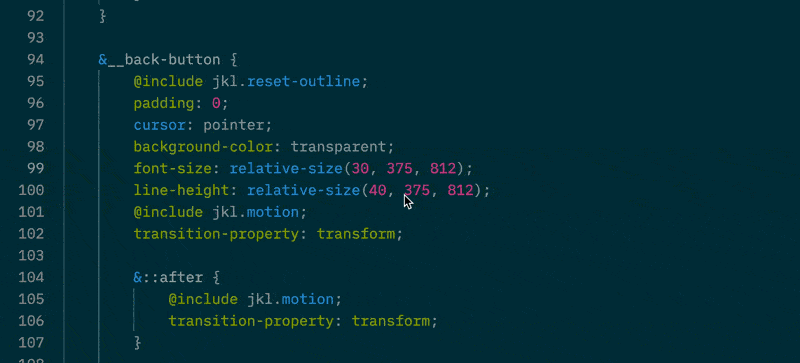

# Some Sass

Some Sass is a [language server extension][langext] for [Visual Studio Code][vscode]. It brings improved code suggestions, documentation and code navigation for [SCSS][scss].

Some features include:

- Full support for [`@use`][use] and [`@forward`][forward], including aliases, prefixes and hiding.
- Workspace-wide code navigation and refactoring, such as Rename Symbol.
- Rich documentation through [SassDoc][sassdoc].
- Language features for [`%placeholders`][placeholder], both when using them and writing them.

## Get the extension

You can find the extension here:

- On the [Visual Studio Code Marketplace][vsmarketplace].
- On the [Open VSX Registry][openvsx].
- In the [Releases section on GitHub][ghreleases].

See the User guide section to learn more about what the extension can do.

## Some Sass Language Server

Some Sass is also a language server using the [Language Server Protocol (LSP)][lsp].

The language server is [published on npm][npm], and can be used with any editor that has an LSP client. See [Getting started](https://wkillerud.github.io/some-sass/language-server/getting-started.html) to learn more.

### Editors with clients

The language server has clients for

- [Visual Studio Code](./vscode-extension#readme)
- [Neovim](https://github.com/neovim/nvim-lspconfig/blob/master/doc/server_configurations.md#somesass_ls)

[lsp]: https://microsoft.github.io/language-server-protocol/
[npm]: https://www.npmjs.com/package/some-sass-language-server
[scss]: https://sass-lang.com/documentation/syntax/
[use]: https://sass-lang.com/documentation/at-rules/use/
[forward]: https://sass-lang.com/documentation/at-rules/forward/
[langext]: https://code.visualstudio.com/api/language-extensions/language-server-extension-guide
[sassdoc]: http://sassdoc.com
[placeholder]: https://sass-lang.com/documentation/style-rules/placeholder-selectors/
[vscode]: https://code.visualstudio.com/
[vsmarketplace]: https://marketplace.visualstudio.com/items?itemName=SomewhatStationery.some-sass
[openvsx]: https://open-vsx.org/extension/SomewhatStationery/some-sass
[ghreleases]: https://github.com/wkillerud/some-sass/releases
