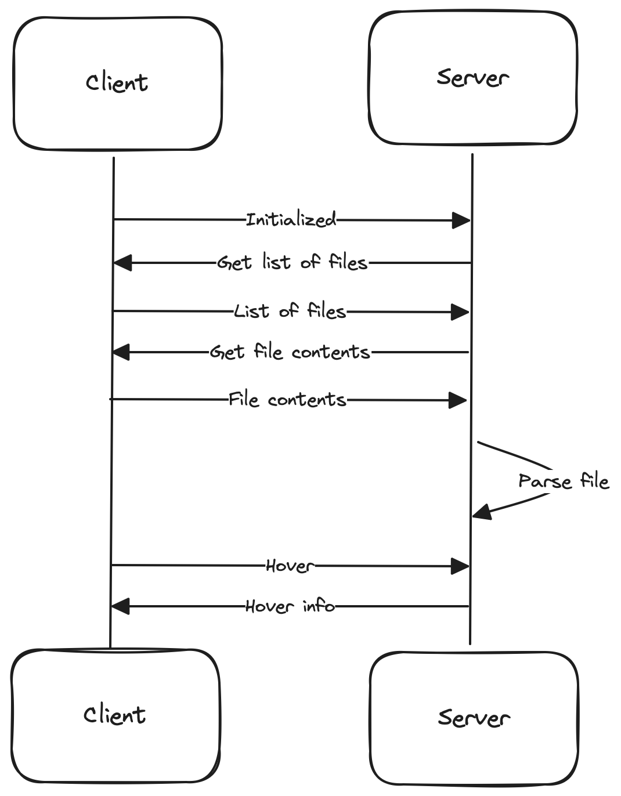
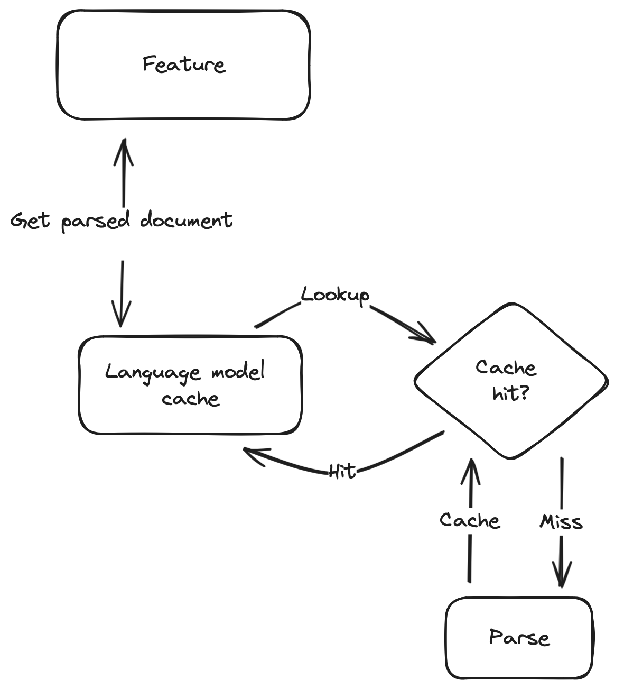

# Architecture

Being a [language server extension](https://code.visualstudio.com/api/language-extensions/language-server-extension-guide), Some Sass consists of a [client](https://github.com/wkillerud/some-sass/blob/main/vscode-extension) and a [server](https://github.com/wkillerud/some-sass/blob/main/packages/language-server). The client starts the server when it opens a file with SCSS. This is called activation.

From there everything happens via [messages](https://microsoft.github.io/language-server-protocol/specifications/lsp/3.17/specification/).

Some Sass also works with Visual Studio Code in the browser. It works more or less the same as the regular Node version, except it doesn't have direct access to the file system.

To work around this, the server makes requests to the client, which then uses the [FileSystem API](https://code.visualstudio.com/api/references/vscode-api#FileSystem) to work with files and directories, before sending the result back to the server.

## Server architecture

The code for the server is divided in three packages:

1. Language server
2. Language services
3. VS Code CSS language service – the SCSS parser and language features that are included in VS Code.

### Language server

This package handles communication with the language client, and not much else.

### Language services

This is where you find the functionality of the language server, organized in classes that inherit from a base `LanguageFeature` class.

All features will parse the given document, but parses are cached for performance reasons. The flow looks something like this:

A language feature takes a text document and will try to get a data structure representing the document's Sass semantics such as variables, classes, functions and mixins.

The first time this happens the document gets sent to the parser, which returns this data structure. That result is cached. The next time a feature tries to get the data structure it will read from the cache. The cache entry is removed when the document changes so the new document can be parsed.

In addition to the parsed document, the cache also holds:

- The results from resolving links (`@use`, `@forward`, `@import`).
- The results from parsing the document's Sassdoc.
- The document's symbols, as returned from `findDocumentSymbols()`.

### VS Code CSS language service

The project includes a private fork of the `vscode-css-languageservice` module. The original `vscode-css-languageservice` powers the CSS, SCSS and Less features in Visual Studio Code. Some Sass uses this module's parser and some of its language features. It's kept as a separate package to simplify updates, and to make it easier to send patches upstream.
