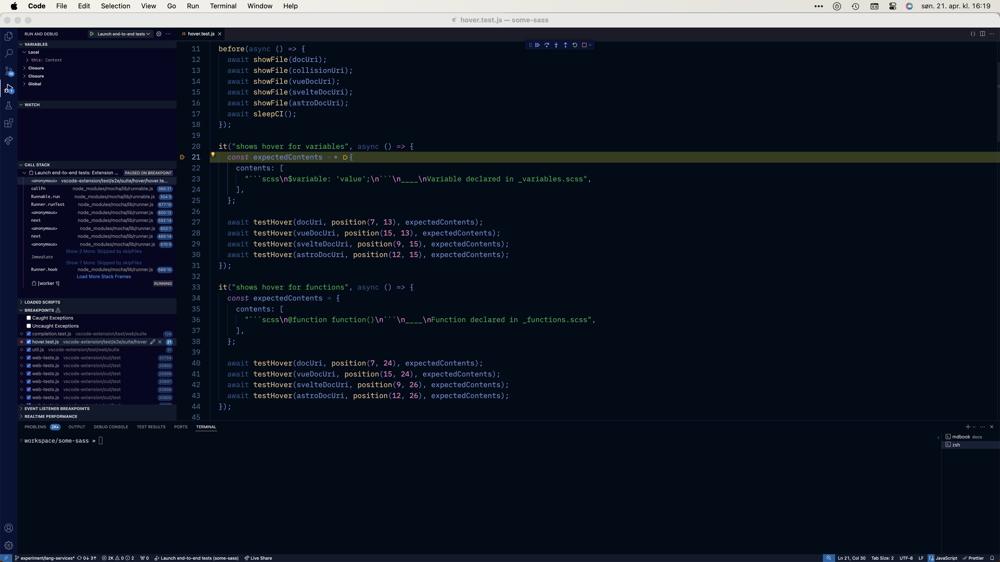

# Debugging end-to-end tests

End-to-end tests run in Visual Studio Code and are helpful to ensure the user experience is as we expect. However, they can be tricky to write sometimes. This document describes how you can debug the tests themselves.

## Prepare Visual Studio Code

The debugger runs tests in your version of Visual Studio Code, not VS Code insiders like when running the tests from the command line. You need to use the default settings for Some Sass (use the included workspace settings from the repo).

[exthost]: https://code.visualstudio.com/api/advanced-topics/extension-host

## Launch the debugger

Go to the [Run and Debug pane][vsdebug] in VS Code and run Launch integration tests. The tests will start running immediately, and the window closes when the test run is finished.

You can set breakpoints directly in the test code in `vscode-extension/test/e2e/`.

[jsapi]: https://code.visualstudio.com/api/references/vscode-api
[vsdebug]: https://code.visualstudio.com/docs/editor/debugging
