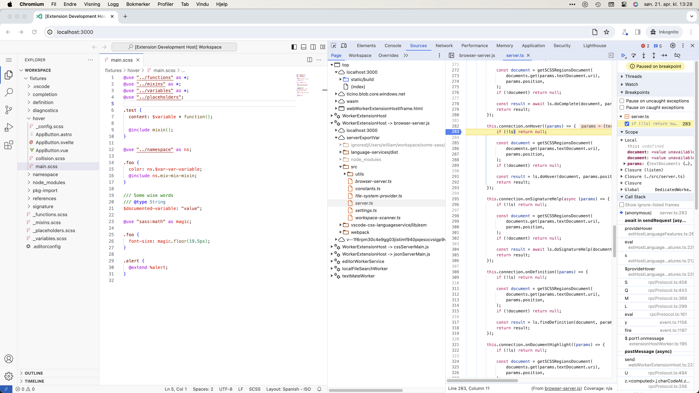

# Debugging in the browser

You can use Some Sass with Visual Studio Code running in the browser. This document describes how you can test Some Sass running in Chromium.

## Run the test command

In a terminal, run:

```sh
npm run start:web
```

This opens Visual Studio Code running as a [web extension host][exthost] in Chromium. The language server runs as a [web worker][worker], and is started when you open a Sass file.

Open the Sass project you're using to test in the extension host window.
If you don't have one you can find several `workspace/`
directories inside `vscode-extension/test/e2e/` in this repository.

## Navigating the Chromium developer tools

Open the developer tools and click the [Sources tab][sources] to set breakpoints.

The web worker for `browser-server.js` is in the left panel of the Sources tab. If you don't see it, make sure you open a Sass file to activate the extension.



In the WorkerExtensionHost you'll see `localhost:3000` and `serverExportVar`. You may find it easier to navigate in `severExportVar` since it uses source maps to match the source code of the language server package.

[exthost]: https://code.visualstudio.com/api/advanced-topics/extension-host
[sources]: https://developer.chrome.com/docs/devtools/sources
[worker]: https://developer.mozilla.org/en-US/docs/Web/API/Web_Workers_API/Using_web_workers
