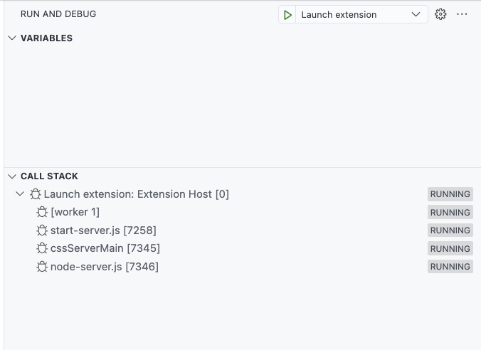
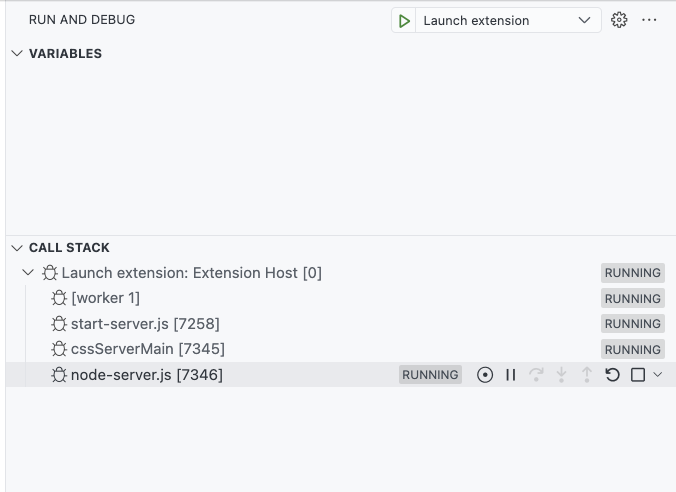

# Debugging performance

Commonly refered to as performance profiling, this document explains how to run a performance test on Some Sass in Visual Studio Code.

## Performance Profiling in Visual Studio Code

To start a performance profile, first [launch the Some Sass extension](./debugging.md) from the Run and Debug pane in Visual Studio Code, then open a file with Sass code. Your debugging pane should look something like the image below.

The Call stack section lists Launch extension, which has four list items. The fourth list item, `node-server.js`, is the Some Sass language server. This is the program we want to profile.

If you've ever done [performance profiling of JavaScript](https://code.visualstudio.com/docs/nodejs/profiling) in VS Code before, profiling Some Sass works the same way.

Click or hover over the `node-server.js` row to show additional controls.

Once the row is active you should see a list of icon buttons. The one we're interested in is the [circle with a dot in the center](https://code.visualstudio.com/docs/nodejs/profiling#_using-the-record-button), Take Performance Profile. Click it, and choose the [type of profile you want](https://code.visualstudio.com/docs/nodejs/profiling#_types-of-profiles). Unless you have specific plans, choose to stop the profile manually when asked.

Do the operations you want to measure (hover, go to definition, edit some code, or what have you). Then, go back to the debugger and click the button again to stop the performance profiling.

## Analyzing a performance profile

You can open the recorded performance profile in Visual Studio Code and dig into the numbers. The VS Code documentation has some tips on [how to analyze a profile](https://code.visualstudio.com/docs/nodejs/profiling#_analyzing-a-profile).
