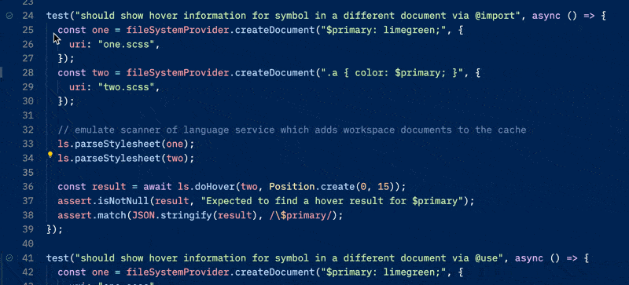
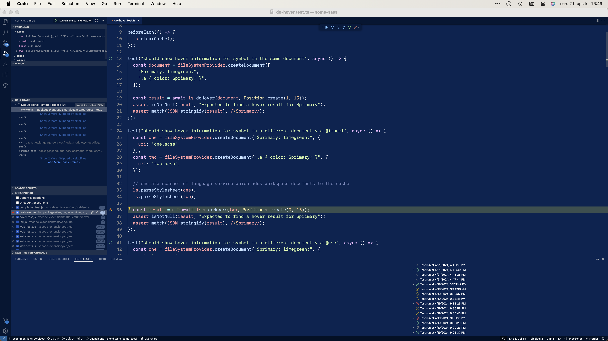

# Debugging unit tests

This document assumes you use Visual Studio Code and have the [Vitest](https://marketplace.visualstudio.com/items?itemName=vitest.explorer) extension.

Open a unit test file and find the test you want to debug.

You should see an icon in the gutter. To debug the test, right click and select Debug test.

If you don't see any icons in the gutter it may be because the Vitest extension expects a different version of the `vistest` module. Try updating `vitest` in the repo and the Vitest extension, then restart VS Code.

## Test-driven development

When you work on a language feature it's useful to set up a test and use that while developing.

The tests have an in-memory file system provider, so you can test how a language feature works with Sass code without making files on disk.

By using the Vitest debugger you can shorten the feedback loop significantly compared to building the whole project and testing manually in Visual Studio Code.

