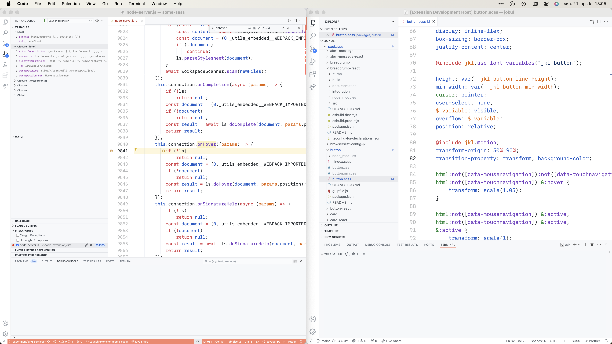
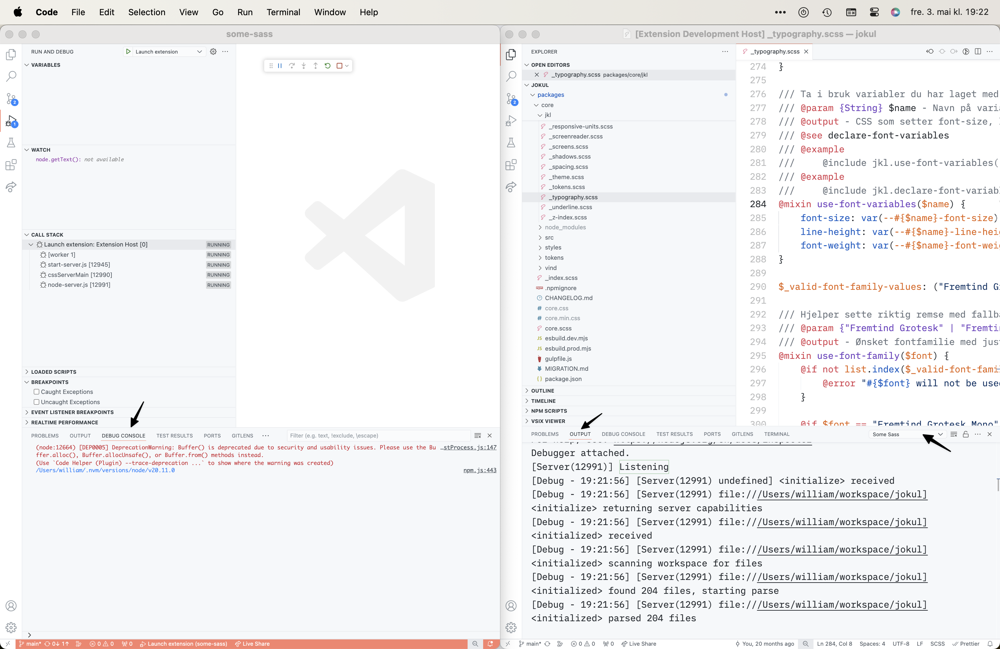
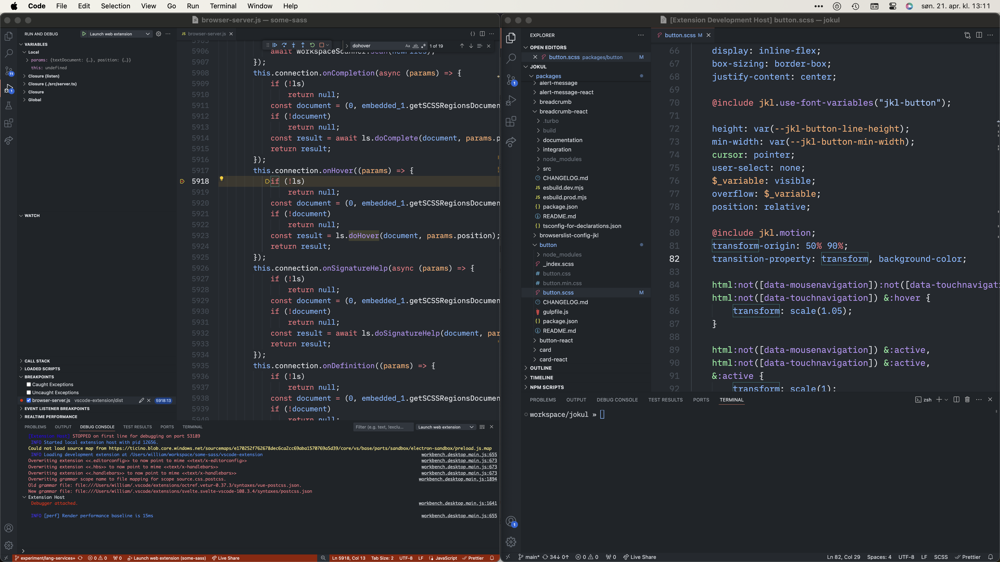

# Debugging

This page assumes you're using Visual Studio Code as the debugger. Go to the [Run and Debug pane][vsdebug] in VS Code to find the different launch configurations.

- Launch extension
- Launch web extension

## Launch extension

This opens a new window of Visual Studio Code running as a [local extension host][exthost]. Open the Sass project you're using to test in the extension host window.
If you don't have one you can find several `workspace/`
directories inside `vscode-extension/test/e2e/` in this repository.

### Set breakpoints

Find `node-server.js` in the `vscode-extension/dist/` folder to set breakpoints. A good place to start is to search for the request handlers in [`server.ts`](https://github.com/wkillerud/some-sass/blob/c9bc681e5ae02870b58d6fc0a3d6e279abaf05d2/packages/language-server/src/server.ts#L264) like `onCompletion` and `onHover`.

Restart the debugger after building to see any changes you make in the code.

### See log output

You'll find the log output in two places:

1. The Debug console in the window where you started the debugger.
2. The Output pane in the extension host (pick Some Sass from the dropdown).

## Launch web extension

This opens a new window of Visual Studio Code running as a [web extension host][exthost]. Open the Sass project you're using to test in the extension host window.
If you don't have one you can find several `workspace/`
directories inside `vscode-extension/test/e2e/` in this repository.

Find `browser-server.js` in the `vscode-extension/dist/` folder to set breakpoints.

Restart the debugger after building to see any changes you make in the code.

[exthost]: https://code.visualstudio.com/api/advanced-topics/extension-host
[vsdebug]: https://code.visualstudio.com/docs/editor/debugging
