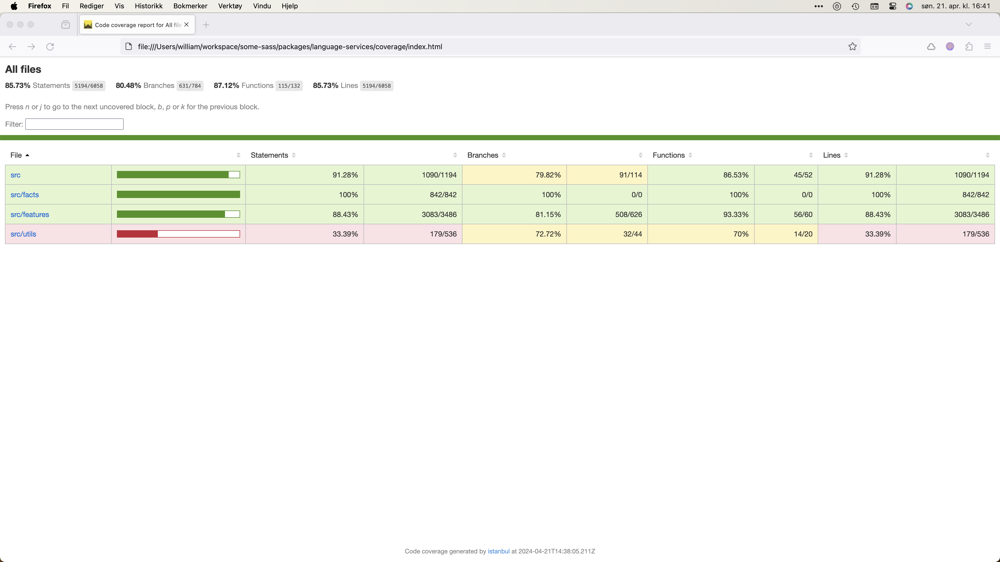

# Test coverage

While there's no target for test coverage in the project, coverage reports can be useful to see if there's a corner case that should be tested.

## Generate a coverage report

Coverage reports are generated per package. To generate a report run:

```sh
npm run coverage
```

Coverage reports are printed to the terminal. HTML versions you can open in a browser get generated in each package's directory. Look for a `coverage/` folder and open `index.html` in your browser.


