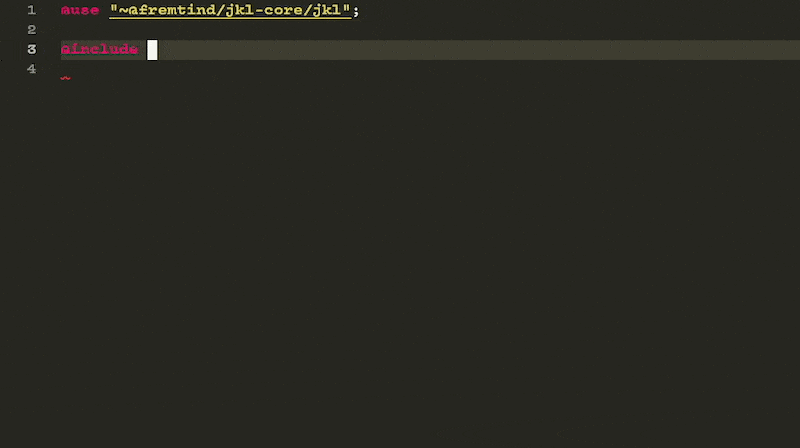
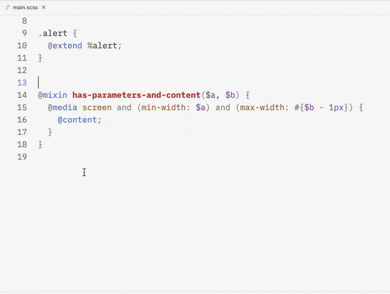
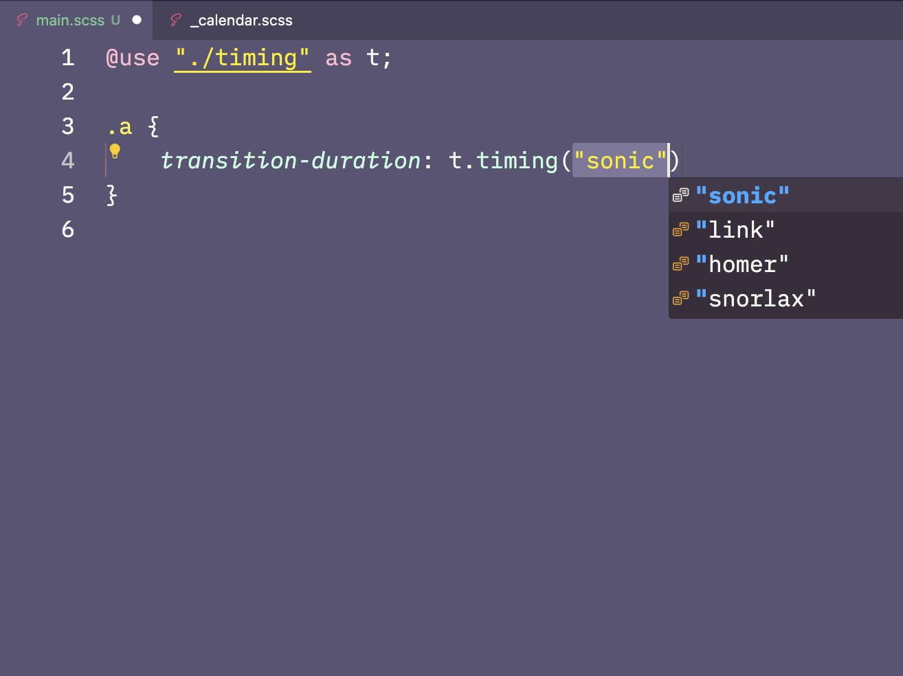
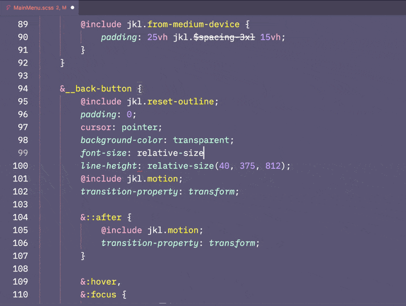
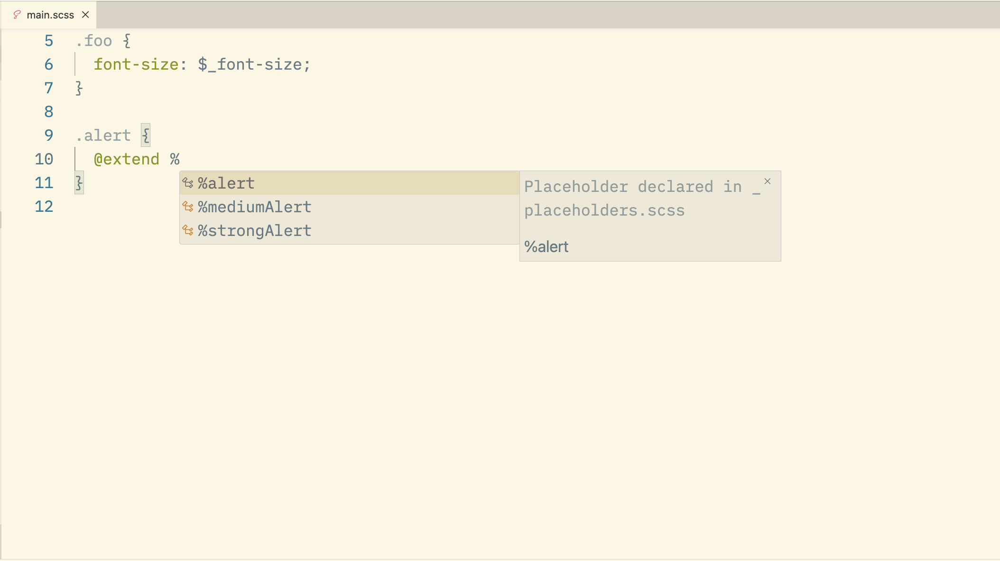
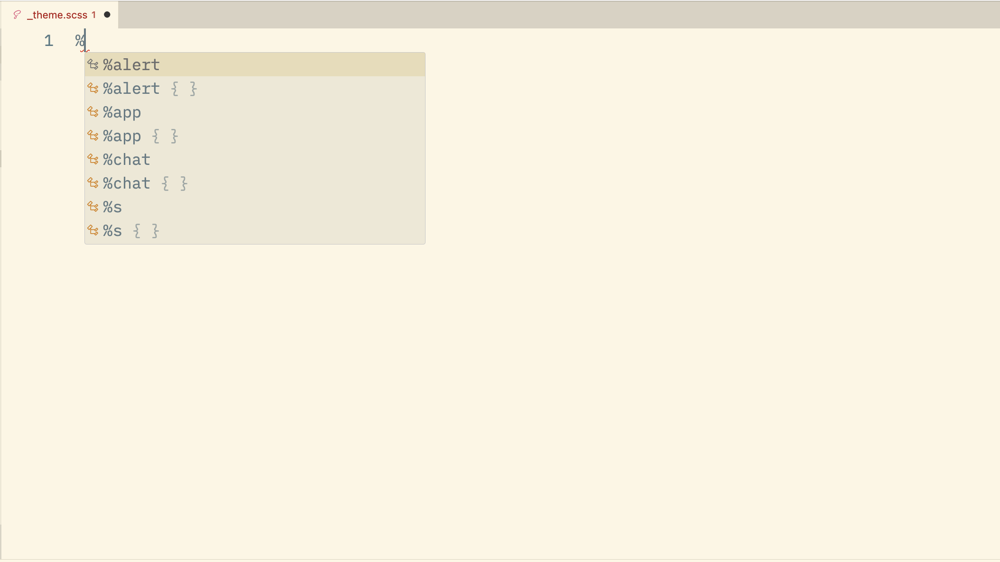
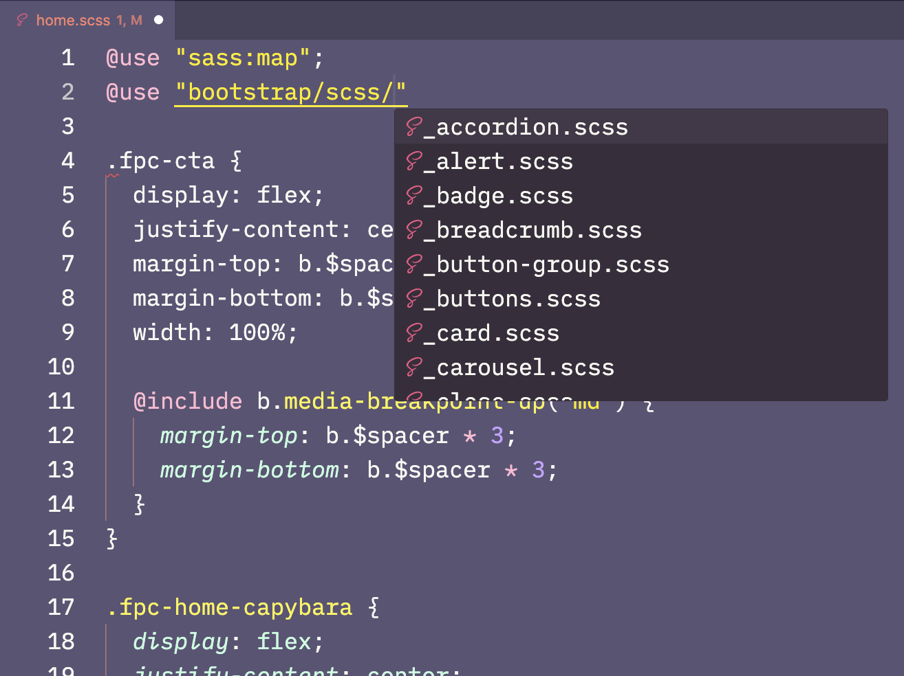
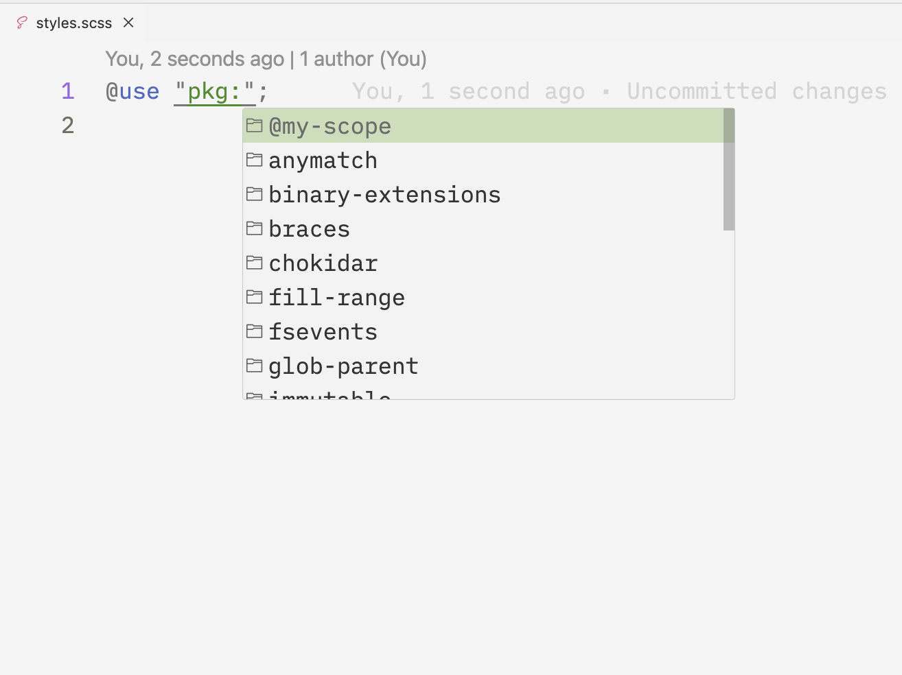

# IntelliSense

This page describes what Some Sass adds to [code completions][intellisense], also called IntelliSense in Visual Studio Code.

## Namespaced suggestions

With the [recommended settings](./settings.md#recommended-settings), suggestions get limited to only the symbols available in that namespace. Code completions from Some Sass has full support for:

- aliasing (`@use "foo" as f`)
- prefixes (`@forward "foo" as bar-*`)
- [hide/show][visibility]

Sass [built-in modules][builtin] (such as `"sass:map"`) get the same treatment when imported with `@use`.



## SassDoc block

Some Sass works best when you document your codebase with [SassDoc]. To make it easier you can let Some Sass generate a skeleton by typing `///` and choosing SassDoc block.



## SassDoc string literal union types

If you have a function or mixin that expects only a set of string values you can document them with a string literal union type. Some Sass will present the list of choices when you use them.

```scss
/// Get a timing value for use in animations.
/// @param {"sonic" | "link" | "homer" | "snorlax"} $mode - The timing you want
/// @return {String} - the timing value in ms
@function timing($mode) {
	@if map.has-key($_timings, $mode) {
		@return map.get($_timings, $mode);
	} @else {
		@error 'Unable to find a mode for #{$mode}';
	}
}
```



## Signature helpers

For functions and mixins, Some Sass gives you signature helpers. These are small popups that show information about the mixin or function's parameters, and which one you are about to enter.



## Placeholder selectors

There are two ways which Some Sass helps with code suggestions for [placeholder selectors][placeholders]:

- `%placeholder`-first workflows
- `@extend`-first workflows

### Placeholder first

This is where you write a placeholder selector first, and then `@extend` it somewhere else in your code. Some Sass will suggest all available placeholder selectors when you type `@extend %`.



### Extend first

This workflow can be useful in scenarios where the selectors change, but the style should stay the same. You define a stylesheet with the selectors, `@extend` stable placeholder selectors, and then implement those placeholders. This workflow is for instance used in parts of the Discord theming community.



## Import suggestions

When you write imports Some Sass reads the file system to help you complete the string.



### `pkg:` imports

You can get a list of packages in the closest `node_modules` folder by manually [triggering IntelliSense][manual] (Ctrl + Space) to help you write `pkg:` imports.



[intellisense]: https://code.visualstudio.com/docs/editor/intellisense#_types-of-completions
[manual]: https://code.visualstudio.com/docs/editor/intellisense#_intellisense-features
[SassDoc]: http://sassdoc.com/annotations#description
[placeholders]: https://sass-lang.com/documentation/style-rules/placeholder-selectors/
[visibility]: https://sass-lang.com/documentation/at-rules/forward/#controlling-visibility
[builtin]: https://sass-lang.com/documentation/modules/
