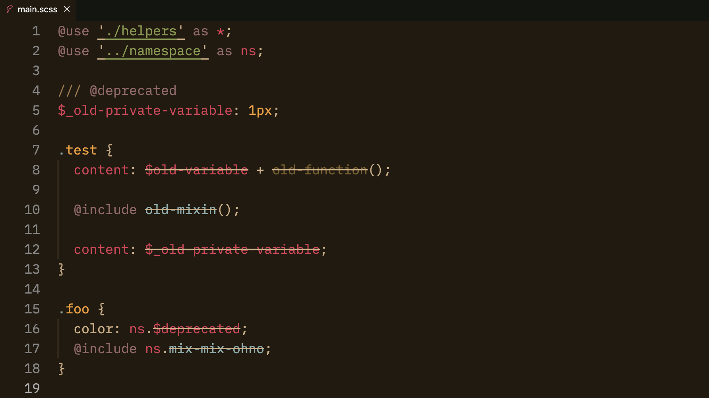

# Diagnostics

This document describes the diagnostics features of Some Sass.

## Deprecated symbols

Symbols documented as [`@deprecated`](http://sassdoc.com/annotations/#deprecated) with SassDoc is shown
with a strikethrough.

