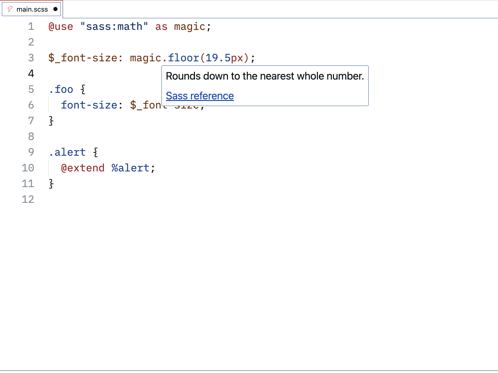

# Hover info

This document describes the hover information given by Some Sass.

## Symbol information

When you hover over a symbol Some Sass shows a preview of the declaration and the name of the file where it was declared. However, things get more interesting when you add SassDoc.

## SassDoc documentation

If a symbol is documented with [SassDoc], the documentation will be shown in the hover information similar to how you might see JSDoc. This is especially helpful if you have a core set of utility functions and mixins, or if you use a Sass library provided by a third party.

```scss
/// Calculate a responsive size value relative to a given screen size
/// Will return a CSS rule that corresponds to the given pixel size at
/// the given screen size and scales with changes in screen size
/// @param {Number} $px-size - Size to calculate from, in px without unit
/// @param {Number} $screen-width - Screen width to calculate from, in px without unit, default 1400
/// @param {Number} $screen-height - Screen height to calculate from, in px without unit, default 900
/// @return {Number} - Input expressed as a responsive value
@function relative-size($px-size, $screen-width: 1400, $screen-height: 900) {
	// ...
}
```


## Sass built-ins

Hover information for Sass built-ins include links to the reference documentation.



## SassDoc annotations

Hover information for Sassdoc annotations link to the reference documentation.


[SassDoc]: http://sassdoc.com/annotations#description
