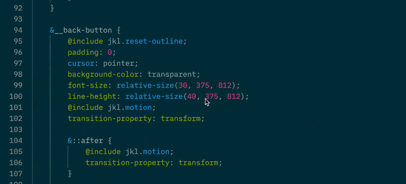
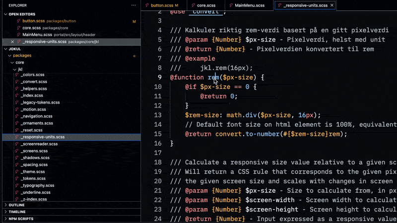

# Navigation

This document describes the navigation features of Some Sass.

## Go to definition

To use this feature, either:

- Hold down `Cmd`/`Ctrl` and click a symbol.
- Right-click a symbol and choose Go to Definition.
- Press `F12` when the cursor is at a symbol.

[Go to definition reference](https://code.visualstudio.com/docs/editor/editingevolved#_go-to-definition).

## Find references

To use this feature, either:

- Right-click a symbol and choose Find all references.
- Press `Shift` + `Alt`/`Opt` + `F12` when the cursor is at a symbol.

[Find all references reference](https://code.visualstudio.com/docs/getstarted/tips-and-tricks#_find-all-references-view).

## Go to symbol

To use this feature, open the Go menu and choos either:

- Go to symbol in Editor
- Go to symbol in Workspace

[Go to symbol reference](https://code.visualstudio.com/Docs/editor/editingevolved#_go-to-symbol).
