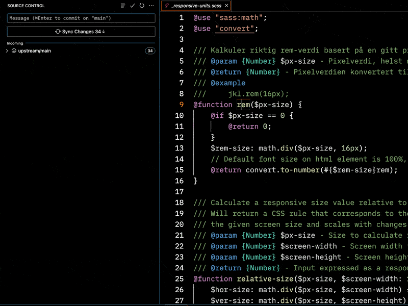
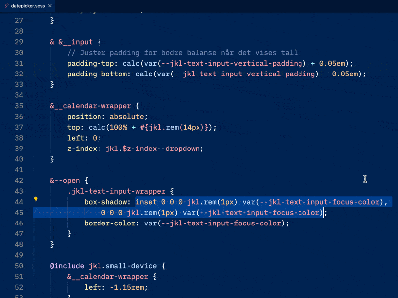

# Refactoring

This document describes the refactoring features of Some Sass.

## Rename symbol

With Some Sass installed you can rename a symbol and it is renamed across the whole workspace.

[Rename symbols reference](https://code.visualstudio.com/docs/editor/refactoring#_rename-symbol)

## Extract

Some Sass adds code actions to extract a selection to a variable, function or mixin.

[Extract actions reference](https://code.visualstudio.com/docs/editor/refactoring#_refactoring-actions)

