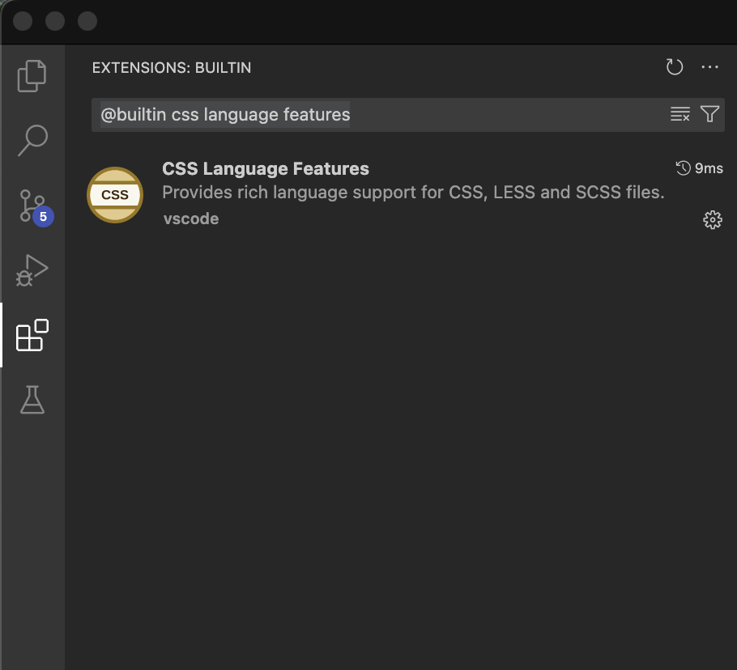

# Settings

This document describes the settings available in Some Sass.

## Recommended settings

These are the recommended settings if you're just getting started.

```jsonc
{
	// Recommended if you don't rely on @import
	"somesass.scss.completion.suggestFromUseOnly": true,
	"somesass.sass.completion.suggestFromUseOnly": true,

	// Optional, if you get suggestions from the current document after namespace.$ (you don't need to type the $ for narrowing down suggestions)
	"editor.wordBasedSuggestions": false,
}
```

### Going all in on Some Sass

If you don't need language features for [Less](https://lesscss.org/) and don't rely on the built-in formatter, we recommend turning off the built-in CSS/SCSS/Less language extension in Visual Studio Code. For formating we recommend [Prettier](https://prettier.io/).

Some Sass has all the features of the built-in language extension, though they are turned off by default.

Once you turn off the built-in language features you can configure Some Sass to handle both CSS and Sass for you. This way you get the best experience without Some Sass and VS Code getting in each others way.

#### How to turn off the built-in language feature

1. Go to the Extensions tab and search for `@builtin css language features`.
2. Click the settings icon and pick Disable from the list.
3. Click Restart extension to turn it off.



#### How to turn on Some Sass language features

Now that you disabled the built-in language features you need to turn on those language features in Some Sass.

Open your user settings JSON and paste this configuration. Restart VS Code to make sure the changes apply.

```json
{
	"somesass.css.codeAction.enabled": true,
	"somesass.css.colors.enabled": true,
	"somesass.css.completion.enabled": true,
	"somesass.css.definition.enabled": true,
	"somesass.css.diagnostics.enabled": true,
	"somesass.css.foldingRanges.enabled": true,
	"somesass.css.highlights.enabled": true,
	"somesass.css.hover.enabled": true,
	"somesass.css.links.enabled": true,
	"somesass.css.references.enabled": true,
	"somesass.css.rename.enabled": true,
	"somesass.css.selectionRanges.enabled": true,
	"somesass.css.signatureHelp.enabled": true,
	"somesass.css.workspaceSymbol.enabled": true,

	"somesass.scss.codeAction.enabled": true,
	"somesass.scss.colors.enabled": true,
	"somesass.scss.colors.includeFromCurrentDocument": true,
	"somesass.scss.completion.enabled": true,
	"somesass.scss.completion.css": true,
	"somesass.scss.completion.includeFromCurrentDocument": true,
	"somesass.scss.definition.enabled": true,
	"somesass.scss.diagnostics.enabled": true,
	"somesass.scss.diagnostics.lint.enabled": true,
	"somesass.scss.foldingRanges.enabled": true,
	"somesass.scss.highlights.enabled": true,
	"somesass.scss.hover.enabled": true,
	"somesass.scss.hover.documentation": true,
	"somesass.scss.links.enabled": true,
	"somesass.scss.references.enabled": true,
	"somesass.scss.rename.enabled": true,
	"somesass.scss.selectionRanges.enabled": true,
	"somesass.scss.signatureHelp.enabled": true,
	"somesass.scss.workspaceSymbol.enabled": true
}
```

## Settings reference

You can configure similar settings for both SCSS, Sass (indented) and CSS. There are also some settings that apply to the workspace regardless of syntax.

### Workspace

| Id                             | Description                                                                                                                                                                                                                                                                                                 | Default                                |
| ------------------------------ | ----------------------------------------------------------------------------------------------------------------------------------------------------------------------------------------------------------------------------------------------------------------------------------------------------------- | -------------------------------------- |
| `somesass.workspace.loadPaths` | A list of paths relative to the workspace root where the language server should look for stylesheets loaded by `@use` and `@import`. `node_modules` is always included. Note that you will have to [configure your Sass compiler separately](https://sass-lang.com/documentation/cli/dart-sass/#load-path). | `[]`                                   |
| `somesass.workspace.exclude`   | List of glob patterns for directories that are excluded in the initial scan for Sass files. Files in the exclude list will still be processed if referenced by `@use`, `@forward` and `@import` (for example a depencendy you use from `node_modules`).                                                     | `["**/.git/**", "**/node_modules/**"]` |
| `somesass.workspace.logLevel`  | Control how much gets logged to the Output window. Possible values are `"silent"`, `"fatal"`, `"error"`, `"warn"`, `"info"`, `"debug"` and `"trace"`.                                                                                                                                                       | `"info"`                               |
| `some-sass.trace.server`       | Log the messages sent between VS Code and the Some Sass language server. Possible values are `"off"`, `"messages"` and `"verbose"`                                                                                                                                                                          | `"off"`                                |

### SCSS

For brevity the ID column omits the `somesass.scss` prefix. For example, to use the setting `codeAction.enabled` use the ID `somesass.scss.codeAction.enabled`.

| Id                                          | Description                                                                                                                                                                                                                           | Default |
| ------------------------------------------- | ------------------------------------------------------------------------------------------------------------------------------------------------------------------------------------------------------------------------------------- | ------- |
| `codeAction.enabled`                        | Enable or disable all code actions.                                                                                                                                                                                                   | `true`  |
| `colors.enabled`                            | Enable or disable all color decorators.                                                                                                                                                                                               | `true`  |
| `colors.includeFromCurrentDocument`         | Compatibility setting for VS Code. By default the built-in SCSS server shows color decorators for variables declared in the current document. To avoid duplicates Some Sass will not show them unless you opt in.                     | `false` |
| `completion.enabled`                        | Enable or disable all completions (IntelliSense).                                                                                                                                                                                     | `true`  |
| `completion.includeFromCurrentDocument`     | Compatibility setting for VS Code. By default the built-in SCSS server shows suggestions for variables, mixins and functions declared in the current document. To avoid duplicates Some Sass will not suggest them unless you opt in. | `false` |
| `completion.suggestFromUseOnly`             | If your project uses the new module system with @use and @forward, you may want to only include suggestions from your used modules.                                                                                                   | `false` |
| `completion.mixinStyle`                     | Controls the style of suggestions for mixins. Options are `"all"`, `"nobracket"` (only show suggestions without brackets) and `"bracket"` (where brackets are suggested, don't suggest without brackets).                             | `"all"` |
| `completion.triggerPropertyValueCompletion` | By default, Some Sass triggers property value completion after selecting a CSS property. Use this setting to disable this behavior.                                                                                                   | `true`  |
| `completion.completePropertyWithSemicolon`  | Insert semicolon at end of line when completing CSS properties.                                                                                                                                                                       | `true`  |
| `definition.enabled`                        | Enable or disable Go to Definition.                                                                                                                                                                                                   | `true`  |
| `diagnostics.enabled`                       | Enable or disable all diagnostics (deprecation, errors and lint rules).                                                                                                                                                               | `true`  |
| `diagnostics.deprecation.enabled`           | Enable or disable deprecation diagnostics (strike-through).                                                                                                                                                                           | `true`  |
| `diagnostics.lint.enabled`                  | Enable or disable all linting.                                                                                                                                                                                                        | `false` |
| `diagnostics.lint.*`                        | For the available lint rules and what they do, see the [VS Code docs for CSS and SCSS lint settings](https://code.visualstudio.com/docs/languages/css#_customizing-css-scss-and-less-settings)                                        |         |
| `foldingRanges.enabled`                     | Enable or disable folding ranges.                                                                                                                                                                                                     | `false` |
| `highlights.enabled`                        | Enable or disable highlights.                                                                                                                                                                                                         | `false` |
| `hover.enabled`                             | Enable or disable all hover information.                                                                                                                                                                                              | `true`  |
| `hover.documentation`                       | Show property and value documentation in CSS hovers.                                                                                                                                                                                  | `true`  |
| `hover.references`                          | Show references to MDN in CSS hovers, Sass documentation for Sass built-in modules and SassDoc for annotations.                                                                                                                       | `true`  |
| `links.enabled`                             | Enable or disable the link provider that lets you click an import and open the file.                                                                                                                                                  | `false` |
| `references.enabled`                        | Enable or disable Find all references.                                                                                                                                                                                                | `true`  |
| `rename.enabled`                            | Enable or disable Rename.                                                                                                                                                                                                             | `true`  |
| `selectionRanges.enabled`                   | Enable or disable selection ranges.                                                                                                                                                                                                   | `false` |
| `signatureHelp.enabled`                     | Enable or disable signature help.                                                                                                                                                                                                     | `true`  |
| `workspaceSymbol.enabled`                   | Enable or disable workspace symbol.                                                                                                                                                                                                   | `true`  |

### Sass indented

For brevity the ID column omits the `somesass.sass` prefix. For example, to use the setting `codeAction.enabled` use the ID `somesass.sass.codeAction.enabled`.

| Id                                          | Description                                                                                                                                                                                               | Default |
| ------------------------------------------- | --------------------------------------------------------------------------------------------------------------------------------------------------------------------------------------------------------- | ------- |
| `codeAction.enabled`                        | Enable or disable all code actions.                                                                                                                                                                       | `true`  |
| `colors.enabled`                            | Enable or disable all color decorators.                                                                                                                                                                   | `true`  |
| `completion.enabled`                        | Enable or disable all completions (IntelliSense).                                                                                                                                                         | `true`  |
| `completion.suggestFromUseOnly`             | If your project uses the new module system with @use and @forward, you may want to only include suggestions from your used modules.                                                                       | `false` |
| `completion.mixinStyle`                     | Controls the style of suggestions for mixins. Options are `"all"`, `"nobracket"` (only show suggestions without brackets) and `"bracket"` (where brackets are suggested, don't suggest without brackets). | `"all"` |
| `completion.triggerPropertyValueCompletion` | By default, Some Sass triggers property value completion after selecting a CSS property. Use this setting to disable this behavior.                                                                       | `true`  |
| `definition.enabled`                        | Enable or disable Go to Definition.                                                                                                                                                                       | `true`  |
| `diagnostics.enabled`                       | Enable or disable all diagnostics (deprecation, errors and lint rules).                                                                                                                                   | `true`  |
| `diagnostics.deprecation.enabled`           | Enable or disable deprecation diagnostics (strike-through).                                                                                                                                               | `true`  |
| `diagnostics.lint.enabled`                  | Enable or disable all linting.                                                                                                                                                                            | `true`  |
| `diagnostics.lint.*`                        | For the available lint rules and what they do, see the [VS Code docs for CSS and SCSS lint settings](https://code.visualstudio.com/docs/languages/css#_customizing-css-scss-and-less-settings)            |         |
| `foldingRanges.enabled`                     | Enable or disable folding ranges.                                                                                                                                                                         | `true`  |
| `highlights.enabled`                        | Enable or disable highlights.                                                                                                                                                                             | `true`  |
| `hover.enabled`                             | Enable or disable all hover information.                                                                                                                                                                  | `true`  |
| `hover.documentation`                       | Show property and value documentation in CSS hovers.                                                                                                                                                      | `true`  |
| `hover.references`                          | Show references to MDN in CSS hovers, Sass documentation for Sass built-in modules and SassDoc for annotations.                                                                                           | `true`  |
| `links.enabled`                             | Enable or disable the link provider that lets you click an import and open the file.                                                                                                                      | `true`  |
| `references.enabled`                        | Enable or disable Find all references.                                                                                                                                                                    | `true`  |
| `rename.enabled`                            | Enable or disable Rename.                                                                                                                                                                                 | `true`  |
| `selectionRanges.enabled`                   | Enable or disable selection ranges.                                                                                                                                                                       | `true`  |
| `signatureHelp.enabled`                     | Enable or disable signature help.                                                                                                                                                                         | `true`  |
| `workspaceSymbol.enabled`                   | Enable or disable workspace symbol.                                                                                                                                                                       | `true`  |

### CSS

For brevity the ID column omits the `somesass.css` prefix. For example, to use the setting `codeAction.enabled` use the ID `somesass.css.codeAction.enabled`.

| Id                                          | Description                                                                                                                                                                                                                                                                                                                                                                                                                                                        | Default |
| ------------------------------------------- | ------------------------------------------------------------------------------------------------------------------------------------------------------------------------------------------------------------------------------------------------------------------------------------------------------------------------------------------------------------------------------------------------------------------------------------------------------------------ | ------- |
| `codeAction.enabled`                        | Enable or disable all code actions.                                                                                                                                                                                                                                                                                                                                                                                                                                | `false` |
| `colors.enabled`                            | Enable or disable all color decorators.                                                                                                                                                                                                                                                                                                                                                                                                                            | `false` |
| `completion.enabled`                        | Enable or disable all completions (IntelliSense).                                                                                                                                                                                                                                                                                                                                                                                                                  | `false` |
| `completion.triggerPropertyValueCompletion` | By default, Some Sass triggers property value completion after selecting a CSS property. Use this setting to disable this behavior.                                                                                                                                                                                                                                                                                                                                | `true`  |
| `completion.completePropertyWithSemicolon`  | Insert semicolon at end of line when completing CSS properties.                                                                                                                                                                                                                                                                                                                                                                                                    | `true`  |
| `definition.enabled`                        | Enable or disable Go to Definition.                                                                                                                                                                                                                                                                                                                                                                                                                                | `false` |
| `diagnostics.enabled`                       | Enable or disable all diagnostics (deprecation, errors and lint rules).                                                                                                                                                                                                                                                                                                                                                                                            | `false` |
| `diagnostics.deprecation.enabled`           | Enable or disable deprecation diagnostics (strike-through).                                                                                                                                                                                                                                                                                                                                                                                                        | `false` |
| `diagnostics.lint.enabled`                  | Enable or disable all linting.                                                                                                                                                                                                                                                                                                                                                                                                                                     | `false` |
| `diagnostics.lint.*`                        | For the available lint rules and what they do, see the [VS Code docs for CSS and SCSS lint settings](https://code.visualstudio.com/docs/languages/css#_customizing-css-scss-and-less-settings)                                                                                                                                                                                                                                                                     |         |
| `foldingRanges.enabled`                     | Enable or disable folding ranges.                                                                                                                                                                                                                                                                                                                                                                                                                                  | `false` |
| `highlights.enabled`                        | Enable or disable highlights.                                                                                                                                                                                                                                                                                                                                                                                                                                      | `false` |
| `hover.enabled`                             | Enable or disable all hover information.                                                                                                                                                                                                                                                                                                                                                                                                                           | `false` |
| `hover.documentation`                       | Show property and value documentation in CSS hovers.                                                                                                                                                                                                                                                                                                                                                                                                               | `false` |
| `hover.references`                          | Show references to MDN in CSS hovers, Sass documentation for Sass built-in modules and SassDoc for annotations.                                                                                                                                                                                                                                                                                                                                                    | `false` |
| `links.enabled`                             | Enable or disable the link provider that lets you click an import and open the file.                                                                                                                                                                                                                                                                                                                                                                               | `false` |
| `references.enabled`                        | Enable or disable Find all references.                                                                                                                                                                                                                                                                                                                                                                                                                             | `false` |
| `rename.enabled`                            | Enable or disable Rename.                                                                                                                                                                                                                                                                                                                                                                                                                                          | `false` |
| `selectionRanges.enabled`                   | Enable or disable selection ranges.                                                                                                                                                                                                                                                                                                                                                                                                                                | `false` |
| `signatureHelp.enabled`                     | Enable or disable signature help.                                                                                                                                                                                                                                                                                                                                                                                                                                  | `false` |
| `workspaceSymbol.enabled`                   | Enable or disable workspace symbol.                                                                                                                                                                                                                                                                                                                                                                                                                                | `false` |
| `customData`                                | A list of relative file paths pointing to JSON files following the [custom data format](https://github.com/microsoft/vscode-css-languageservice/blob/master/docs/customData.md). Some Sass loads custom data on startup to enhance its CSS support for CSS custom properties (variables), at-rules, pseudo-classes, and pseudo-elements you specify in the JSON files. The file paths are relative to workspace and only workspace folder settings are considered. | `[]`    |
